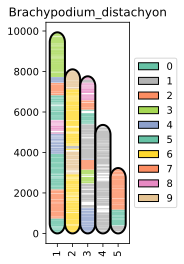

# GouMang: Genomes Collinearity Analysis Framework

**GouMang** is a comprehensive toolkit for comparative genomics analysis, specializing in multi-species genome collinearity identification, gene segment clustering, and genome structure analysis. The framework provides a series of scripts for processing genomic data, analyzing collinearity relationships, and visualizing the results.

## Features
---

- **Genome Breakpoint Analysis**: Identifies and splits genomes at breakpoints based on collinearity relationships.
- **Gene Segment Clustering**: Performs hierarchical clustering on genomic segments to identify conserved regions.
- **Conserved Gene Cluster Reconstruction**: Reconstructs a shared ancestral gene order within clustered gene segment groups.
- **Data Visualization**: Provides various utilities for visualizing genomic data.

## Dependencies
---
The toolkit requires the following Python libraries:
- numpy
- pandas
- scipy
- scikit-learn
- matplotlib
- seaborn
- networkx
- umap-learn
- sortedcontainers

Additionally, the core analysis workflow depends on the following third-party bioinformatics software. Please ensure you have them installed and configured correctly:

Collinearity Analysis: [JCVI](https://github.com/tanghaibao/jcvi) (recommended) or [WGDI](https://github.com/SunPengChuan/wgdi)

Ortholog Inference: [OrthoFinder](https://github.com/davidemms/OrthoFinder)


## Installation
---

1. Clone this repository:
 ```bash
git clone https://github.com/Flying-Doggy/GouMang
cd GouMang
```

2. Install required Python dependencies using pip:
```shell
pip install -r requirements.txt
```

## Usage Guide
---

### Step1. Obtain Pairwise Anchors Between Species


The analysis in the GouMang framework relies on collinearity results generated by [JCVI](https://github.com/tanghaibao/jcvi).

Before you begin, ensure that your genome sequence files (.pep or .cds) and gene annotation files (.bed) for all species are correctly formatted and named according to [JCVI's requirements](https://github.com/tanghaibao/jcvi/wiki/MCscan-(Python-version)), and place them in the same input directory.


Once the files are ready, you can run the `anchors.py` to generate pairwise collinearity anchor files (.anchors) for all species:
**Usage Paradigm**
`python anchors.py <input_directory> --anchors-dir <output_directory> [options]`

**Usage Example**
`python anchors.py test/genome_dir --anchors-dir test/genome_dir/anchors/`

**Parameter Descriptions**
```text
input_directory: (Required) The directory containing the sequence files (.pep/.cds) and gene annotation files (.bed) for all species.

--anchors-dir: (Optional) The output directory for the generated .anchors files. Defaults to anchors.

--reference: (Optional) Specify the prefix name of a reference species. If set, the script will only perform comparisons between all other species and this reference, instead of an all-vs-all comparison.

--jcvi-args: (Optional) Additional arguments to be passed to JCVI, provided as a string. Example: "--no_dotplot --no_strip_names".

--cpus: (Optional) The number of CPU cores to allocate for the JCVI run. Defaults to 8.

--dbtype: (Optional) The type of sequence to use for collinearity analysis. Options are prot (protein) or cds (coding sequence). Defaults to prot.

--parallel: (Optional) The number of target species groups to process in parallel to improve efficiency. Defaults to 1.

--keep-intermediates: (Optional) Keep the intermediate database files generated during the JCVI run. By default, they are deleted.

--dry-run: (Optional) Print the commands that would be executed without actually running them. Useful for debugging.

--log-file: (Optional) Specify the output path for the log file.
```


### Step2. Genome Segmentation Based on Collinearity

Use the `split_lineage_chromsomes.py` to segment the chromosomes of each species into multiple conserved genomic fragments based on the collinearity relationships identified in Step 1. 
These fragments represent **conserved lineage blocks** from an evolutionary perspective.

**Usage Paradigm**
`python split_lineage_chromsomes.py --anchors_dir <anchors_directory> --bed_dir <bed_directory> --output_dir <output_directory> [options]`

**Usage Example**
```shell
python src/split_lineage_chromsomes.py  --anchors_dir test/genome_dir/anchors/ \
    --bed_dir test/genome_dir/ \
    --output_dir test/splitted
```

**Parameter Descriptions**
```text
--anchors_dir: (Required) The directory containing the .anchors files generated in Step 1.

--bed_dir: (Required) The directory containing the gene annotation (.bed) files for all species.

--output_dir: (Required) The output directory for the segmentation results.

--insulation_threshold: (Optional) Specify an Insulation Score threshold for identifying breakpoints. If not provided, the script will automatically evaluate and select the optimal threshold.

--min_chrom_length: (Optional) Only process chromosomes with a number of genes greater than this value. Defaults to 500.

--keep_interaction_matrices: (Optional) Export the intra-chromosomal interaction matrices to CSV files. Disabled by default.

--verbose: (Optional) Enable detailed logging mode.
```

**Output File Descriptions**
- `chromosome_splits.csv`: Contains metadata for each segmented genomic fragment, including species, chromosome, start/end positions, and gene lists.
- `insulation_scores.csv`: The calculated Insulation Scores for all genomic windows.
- `threshold_evaluation.csv`: Evaluation metrics for different Insulation Score thresholds.
- `collinear_blocks.csv`: Information on collinear blocks extracted and merged from all .anchors files.

### Step3. Unify and Cluster Segments Based on Orthogroups

To cluster genomic segments from different species, all gene IDs must be unified into a cross-species comparable format. We use Orthogroups (OGs) inferred by OrthoFinder for this purpose.

First, run [OrthoFinder](https://github.com/davidemms/OrthoFinder) according to its manual to obtain the `Orthogroups.tsv` file.
`orthofinder -f genome_dir/`

Next, use the `segments_unifier.py`  to convert the segmented genomic fragments into an OG-based format and cluster functionally similar segments into groups. Each cluster represents a set of homologous genomic regions, and the script reconstructs an ancestral super-segment for each group.

**Usage Paradigm**
`python segments_unifier_Gemini.py --segments <segments_csv> --orthogroups <orthogroups_tsv> --output <output_bed> [options]`

**Usage Example**
```shell
python segments_unifier.py \
    --segments splitted/chromosome_splits.csv  \
    --orthogroups genome_dir/OrthoFinder/Results_Oct13/Orthogroups/Orthogroups.tsv \
    --output segments_group_representatives.bed
```

**Parameter Descriptions**
```text
--segments: (Required) The path to the chromosome_splits.csv file generated in Step 2.

--orthogroups: (Required) The path to the Orthogroups.tsv file generated by OrthoFinder.

--output: (Optional) The output path for the BED format file containing the reconstructed ancestral super-segments. Defaults to SegClust.bed.

--phased-ratio: (Optional) The proportion of the longest segments to be used for the initial core clustering phase. Defaults to 0.2.

--clade: (Optional) Path to a file providing clade annotations for the species.

--log-level: (Optional) Set the logging level (DEBUG, INFO, WARNING, ERROR). Defaults to INFO.
```

### Step4. Construct the Ancestral Super-Segment Genome

In this step, we will create sequence files for the ancestral super-segments and then filter the (unconserved) genes to build a "limited" version of the genomes for downstream analysis.

#### 4.1 Generate Representative OG Sequences
First, extract the longest sequence for each OG to serve as its representative sequence.

**Usage Paradigm**
`python fasta_parser.py generate_OG_representatives --dir <og_sequences_dir> --output <output_fasta>`

**Usage Example**
```shell
python fasta_parser.py generate_OG_representatives \
    --dir test/genome_dir/OrthoFinder/Results_Oct13/Orthogroup_Sequences/ \
    --output test/OG_seq.fa
```

**Parameter Descriptions**
```text
--dir: The path to the Orthogroup_Sequences directory generated by OrthoFinder.

--output: The output path for the representative OG sequences FASTA file.
```

#### 4.2 Extract Ancestral Super-Segment Sequences
Based on the BED file from Step 3, extract the full sequences for the ancestral super-segments from the representative OG sequences.

This module supports **regex-based** gene ID matching, enabling flexible prefix handling (e.g., species tags or numeric IDs).

**Usage Paradigm**
`python fasta_parser.py extract_seqs --bed <ancestor_bed> --genome <og_fasta> --prefix <regex_pattern> --output <output_fasta>`

**Usage Example**
```shell
python fasta_parser.py extract_seqs \
    --bed test/segments_group_representatives.bed  \
    --genome  test/OG_seq.fa \
    --prefix [0-9]+- \
    --output test/super_segments.fa
```

**Parameter Descriptions**

``` text
--bed: The segments_group_representatives.bed file from Step 3.

--genome: The OG_seq.fa file from step 4.1.

--prefix: A regular expression to match and remove prefixes from gene IDs in the BED file, allowing them to match the IDs in the FASTA file.

--output: The output path for the ancestral super-segment FASTA file.
```

#### 4.3 Filter by Gene Frequency and Generate "Limited" Genomes

To exclude non-conserved genes or those that appear multiple times in the ancestral genome (possibly due to duplication events), we filter based on OG frequency. We then generate corresponding "limited" BED and FASTA files for the ancestral genome and each species.

**Usage Paradigm**
`python fasta_parser.py extract_limited --orthogroups <og_tsv> --ancestor_bed <anc_bed> --ancestor_genome <anc_fasta> --genome_dir <genomes_dir> --output_dir <output_dir> [options]`

**Usage Example**
```shell
python fasta_parser.py extract_limited  \
    --orthogroups test/genome_dir/OrthoFinder/Results_Oct13/Orthogroups/Orthogroups.tsv \
    --ancestor_bed test/segments_group_representatives.bed  \
    --ancestor_genome  test/super_segments.fa \
    --genome_dir test/genome_dir/  \
    --output_dir test/lt_2  \
    --max_freq 2 \
    --prefix [0-9]+-
```

**Parameter Descriptions**
```text
--orthogroups: The Orthogroups.tsv file.

--ancestor_bed: The segments_group_representatives.bed file from Step 3.

--ancestor_genome: The super_segments.fa file from Step 4.2.

--genome_dir: The directory containing the original sequence and BED files for all species.

--output_dir: The output directory for all "limited" genome files.

--max_freq: (Optional) The maximum copy number for an OG to be retained in the ancestral genome. Defaults to 2.

--prefix: (Optional) A regular expression for matching prefixes on gene IDs in the ancestral BED file.
```

### Step5. Annotate Existing Chromosomal Regions

By aligning the "limited" genomes of all species against the "limited" ancestral genome, we can determine the ancestral composition of each extant chromosome.

Run the `anchors.py` again, this time using the "limited" ancestral genome as the reference (**--reference**).
```shell
python src/anchors.py test/lt_2/ \
    --anchors-dir test/lt_2/anchors \
    --reference ancestor_limited
```
Note. the suffix of sequence file should be `cds` or `pep`


Finally, run the `mapping_analysis.py` to parse the collinearity results, compute a chromosome similarity matrix, and cluster all species' chromosomes to identify their relationships with ancestral regions.

**Usage Paradigm**
`python mapping_analysis.py --ref_bed <anc_limited_bed> --bed_dir <limited_genomes_dir> --anchor_dir <new_anchors_dir> --output_prefix <prefix> [options]`

**Usage Example**
```shell
python src/mapping_analysis.py  \
    --ref_bed test/lt_2/ancestor_limited.bed  \
    --bed_dir test/lt_2/ \
    --anchor_dir test/lt_2/anchors/ \
    --output_prefix test/lt_2/lt_2_mapping_res \
    --reannote_ref
```

**Parameter Descriptions**
```
--ref_bed: The BED file for the "limited" ancestral genome (ancestor_limited.bed).

--bed_dir: The directory containing all "limited" genome BED files (lt_2).

--anchor_dir: The anchors directory from Step 5.1.

--output_prefix: The prefix for all output files.

--reannote_ref: (Optional) If provided, the script will re-annotate the unified gene segment regions with the clustering results.
```

### Step6. visualization

The output of `mapping_analysis.py` can be used for various visualizations. The `goumang_plot.py` and the [visualization.ipynb](src/visualization.ipynb) notebook provide examples for plotting segmented chromosome diagrams.
 

You can find more details and code examples on how to generate such images in [visualization.ipynb](src/visualization.ipynb).